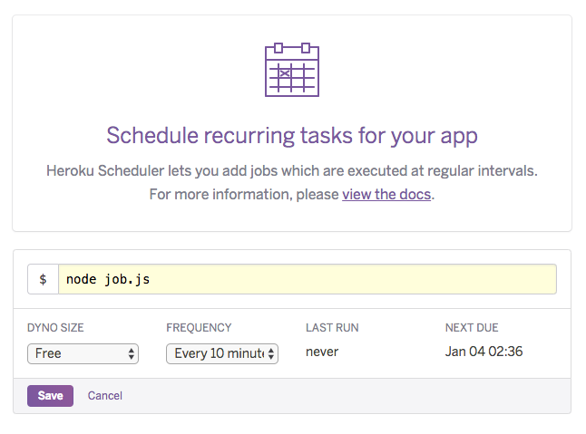

# Salesforce IoT Explorer Activity Error Notification

You will receive an email when an error occurs in Activity Log.

## Prerequisites

1. Salesforce account with IoT Explorer

2. Heroku account to run a job gets an error in activity log every 10mins. In case you do not have it yet, please go to https://signup.heroku.com/login for signup.


## Installing

Install codes to your heroku account via clicking the following heroku button. During install, you fill out the following configuration vars.

* EMAIL_SUBJECT : This is an email subject which you send
* FROM_EMAIL_ADDRESS : This will display to the user as the email address who sent this email. Sendgrid will send the verification email to the address you enter in this field
* SENDGRID_API_KEY : After install, enter sendgrid API key. Please refer to https://sendgrid.com/docs/ui/account-and-settings/api-keys/#creating-an-api-key for creating API key
* SFDC_API_VERSION : Salesforce API Version
* SFDC_LOGIN_URL : In case you want to login sandbox, please enter https://test.salesforce.com
* SFDC_PASSWORD : Salesforce Password
* SFDC_SECURITY_TOKEN : Salesforce Security Token
* SFDC_USERNAME : Salesforce Username
* TO_EMAIL_ADDRESS : This is an email address which you want to notify


[](https://heroku.com/deploy)

## Post Installation

* Enter sendgrid API key at SENDGRID_API_KEY config var

* Stop web dyno using the following command or heroku web GUI
```
heroku ps:scale web=0
```
* Schedule job running every 10 mins on Heroku Scheduler GUI




## Installation Guide on Youtube

[](https://www.youtube.com/watch?v=ypszUB7zzTk)

## License
[MIT](https://choosealicense.com/licenses/mit/)